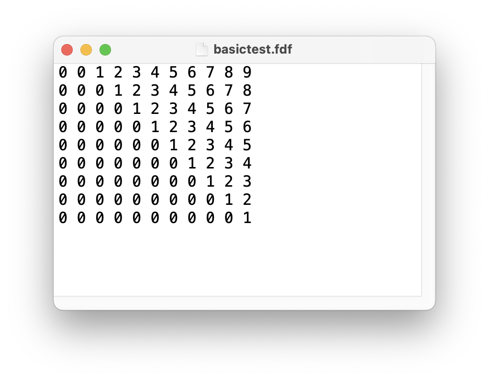

# **FDF (french: "Fil de Fer" - Wireframe Model)**

This project is about representing a landscape as a 3D object in which all surfaces are outlined as lines.
<br><br>

## **Platform**

Mac OS (x86). Additional build options required to build Linux version of binary.
<br><br>

## **Instruments**

This project uses "**miniLibX** (libmlx)" API library to simplify working with **OpenGL** and **AppKit** in case of macOS and **X11** in case of Linux. 

Also **"libft"** self-written libc functions library is used due to educational subject restrictions.

Source files are lintered by "**42 Norminette**" linter.
<br><br>

## **Input**

Input file must be formatted as *.fdf and represent a grid of heights.



## **Build and launch**

Building binary
```console
host@name:~$ make
host@name:~$
```
Launching
```console
host@name:~$ ./fdf maps/pyramide.fdf
host@name:~$
```
<br><br>

## **Algorithm**

Scene is redrawn with each iteration of main loop (mlx_loop_hook). Controls handling is running in separate thread (mlx_hook).

Wu algorithm is implemented to draw smooth lines based on too points screen coordinates.

Custom lines truncation algo is implemented to avoid pixels writing out of the image buffer.
<br><br>

## **Features**

"Free camera" mode is provided (keyboard + mouse).

Both parallel and perspective projections are available.

Keys sensitivity also can be adjusted.
<br><br>

## **Example**

<br>

<br>
